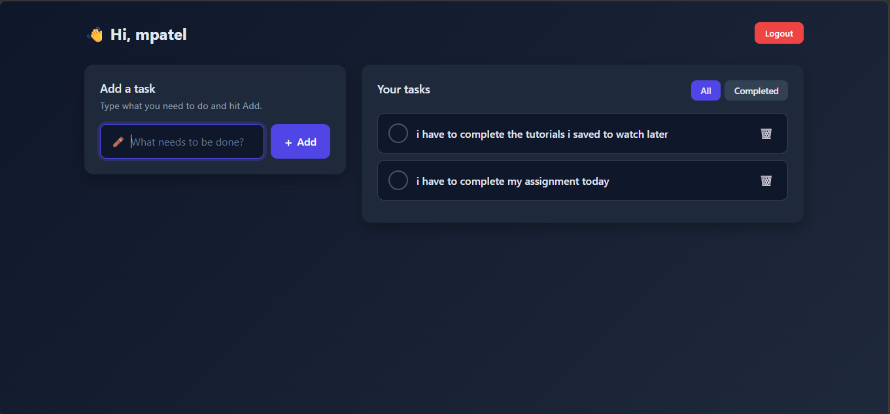
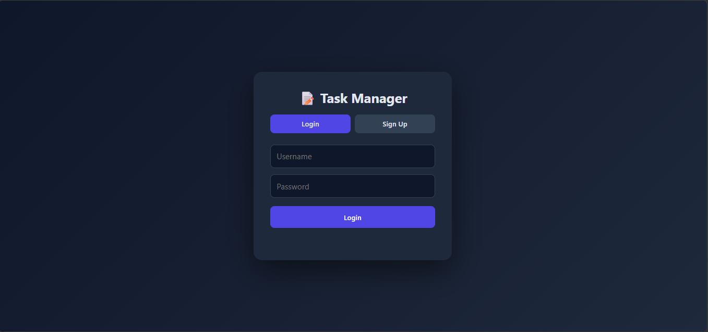

# Task Manager — FastAPI + PostgreSQL

A full-stack task manager with JWT authentication, built with FastAPI, PostgreSQL, and a hand-crafted dark UI.




## Features

- 🔐 JWT-based signup & login
- ✅ Create, complete, and delete tasks
- 🎯 Filter by All / Completed
- 🌙 Custom dark UI (no CSS framework)
- 🐘 PostgreSQL persistence via SQLAlchemy

## Tech Stack

**Backend:** FastAPI, SQLAlchemy 2.0, PostgreSQL (psycopg3), python-jose, passlib  
**Frontend:** Jinja2 templates, vanilla JS, custom CSS

## Setup

### 1. Clone & install
```bash
git clone https://github.com/YOUR_USERNAME/fastapi-task-manager.git
cd fastapi-task-manager
python -m venv venv
source venv/bin/activate    # Windows: venv\Scripts\activate
pip install -r requirements.txt
```

### 2. Configure environment
```bash
cp .env.example .env
# Then edit .env with your Postgres URL and a strong SECRET_KEY
```

Generate a secret key:
```bash
python -c "import secrets; print(secrets.token_hex(32))"
```

### 3. Create the database
```sql
CREATE DATABASE taskdb;
CREATE USER taskuser WITH PASSWORD 'yourpassword';
GRANT ALL PRIVILEGES ON DATABASE taskdb TO taskuser;
```

### 4. Run
```bash
uvicorn main:app --reload
```

Open http://localhost:8000

## Project Structure

```
.
.
├── main.py              # FastAPI app entry
├── auth.py              # JWT + password hashing
├── database.py          # SQLAlchemy engine/session
├── models.py            # ORM models
├── schemas.py           # Pydantic schemas
├── dependencies.py      # get_db, get_current_user
├── routers/
│   ├── users.py         # /api/users/*
│   └── tasks.py         # /api/tasks/*
├── templates/
     ├──dashboard.html
     ├──index.html         # Jinja2 HTML
├── static/
│   ├── css/
      └──auth.css
      └──dashboard.css
│   └── js/
        └──auth.js
      └──dashboard.js
├── docs/
│   ├── dashboard.png
│   └── login_signup.png
└── requirements.txt
```

## License

MIT
